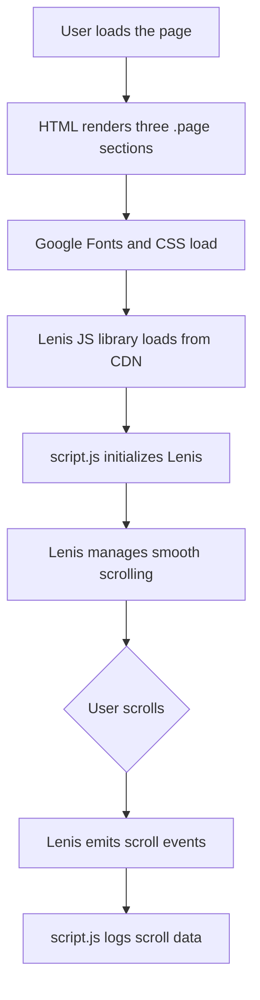
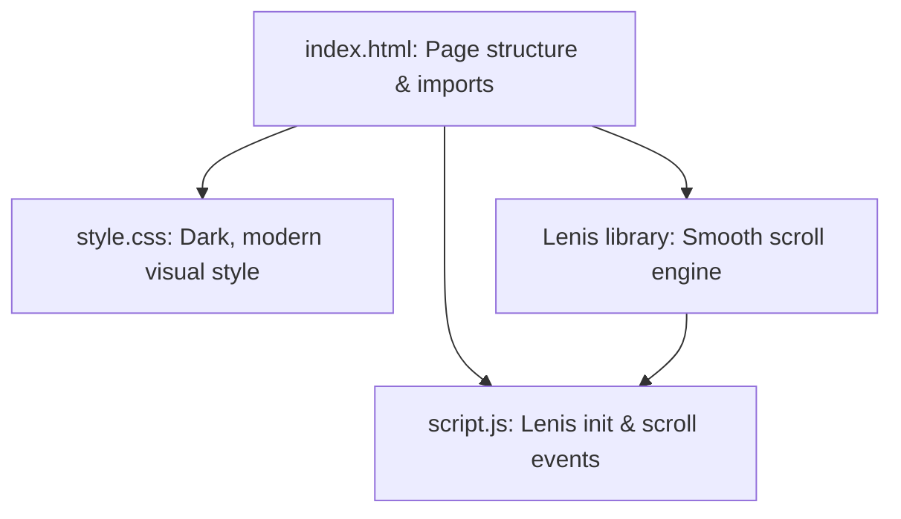

# Lenis Scroll Simple Demo 🚄

This project demonstrates how to use [Lenis](https://github.com/studio-freight/lenis), a modern smooth-scrolling JavaScript library, to create a fluid, appealing scroll experience. The example features a minimalist dark theme, custom fonts, and a simple JavaScript integration for smooth scrolling and easy scroll event tracking.

---

## What’s in This Demo? 🔎

- **index.html**: Lays out the content and imports both the Lenis library and fonts.
- **style.css**: Applies a bold, modern, dark aesthetic with centered, prominent text.
- **script.js**: Initializes Lenis and listens for scroll events.

---

## index.html

This HTML file builds the page structure, loads styles, fonts, and brings in the Lenis smooth-scroll library.

```html
<!DOCTYPE html>
<html lang="en">
<head>
  <meta charset="UTF-8">
  <meta name="viewport" content="width=device-width, initial-scale=1.0">
  <!-- Google Fonts: Poppins -->
  <link rel="preconnect" href="https://fonts.googleapis.com">
  <link rel="preconnect" href="https://fonts.gstatic.com" crossorigin>
  <link href="https://fonts.googleapis.com/css2?family=Poppins:wght@100;200;300;400;500;600;700;800;900&display=swap" rel="stylesheet">
  <title>Document</title>
  <link rel="stylesheet" href="style.css">
</head>
<body>
  <div class="page">Divyanshu</div>
  <div class="page">Karmakar</div>
  <div class="page">Singh</div>
  <script src="https://unpkg.com/lenis@1.3.14/dist/lenis.min.js"></script>
  <script src="script.js"></script>
</body>
</html>
```

### Structure Overview

- **Fonts**: Loads the Poppins font for a modern, clean look.
- **Styles**: Links to `style.css` for custom dark theme styling.
- **Scrollable Sections**: Three `.page` divs, each filling the viewport and displaying large text.
- **Lenis JS**: Loads Lenis (from CDN) for smooth scroll, and then your custom `script.js`.
- **Responsiveness**: Uses viewport meta tag for mobile-friendliness.

---

## style.css

This file defines the page's visual style, ensuring the scroll content is clear, centered, and visually compelling.

```css
* {
  margin: 0;
  padding: 0;
  box-sizing: border-box;
  font-family: 'Poppins';
}

body {
  width: 100%;
  height: 100vh;
  background-color: #000;
  color: white;
}

.page {
  height: 100%;
  width: 100%;
  background-color: #222;
  display: flex;
  align-items: center;
  justify-content: center;
  font-size: 3rem;
  border-bottom: 10px solid #111;
}
```

### Key Styling Features

- **Global Reset**: Removes browser default margins and paddings for predictable layout.
- **Font**: Applies Poppins to all elements for a clean, modern feel.
- **Body**: Sets a black background and full viewport height.
- **.page Class**:
  - Each `.page` fills the viewport (`height: 100%`), so each name is on its own screen.
  - Uses Flexbox to center content both vertically and horizontally.
  - Large font size (`3rem`) for bold impact.
  - Distinct background (`#222`) and a thick bottom border (`10px solid #111`) for strong separation.

---

## script.js

This script initializes Lenis for smooth scrolling and tracks scroll events in the console.

```js
const lenis = new Lenis({ autoRaf: true });

lenis.on('scroll', (e) => {
  console.log(e);
});
```

### What Happens Here?

- **Initialization**:
  - Creates a new Lenis instance with `autoRaf: true`, meaning Lenis handles its own animation frame updates.
- **Scroll Event Listener**:
  - Sets up a listener for `'scroll'` events.
  - Logs the scroll event object to the console, letting you inspect scroll position and speed live as you scroll.

---

## How Does Lenis Work in This Project? 🛤️

Here’s a high-level flow of how the files work together to deliver a buttery smooth scroll:



---

## Lenis Features Used in This Demo ⚙️

- **Smooth Scrolling**: Replaces “jumpy” default scroll with a smooth, inertia-like feel.
- **Auto Animation**: `autoRaf: true` makes Lenis handle animation frame updates automatically.
- **Scroll Event Tracking**: Listens for all scroll changes, enabling live UI feedback or analytics.
- **Minimal Setup**: No framework or build tools required—just plain HTML, CSS, and JS.

---

## How I Used Lenis Step-by-Step

1. **HTML**: Added three `.page` sections for vertical scrolling.
2. **Styling**: Used Flexbox and bold text for clear, centered content.
3. **Lenis Initialization**:
    - Imported the library from CDN.
    - Created a Lenis instance with one line in `script.js`.
4. **Scroll Listening**:
    - Subscribed to scroll events for debugging or future features.

---

## Customization Ideas 💡

- **Add More Pages**: Just add more `<div class="page">...</div>` for a longer scroll.
- **Dynamic Effects**: Animate elements based on scroll position using the event data.
- **Horizontal Scroll**: Experiment with Lenis’s settings to enable horizontal scrolling.
- **Custom Triggers**: Use scroll events to reveal, hide, or animate other UI components.
- **Advanced Options**: Explore Lenis’s [API](https://github.com/studio-freight/lenis#api) for momentum, scrollTo, and more.

---

```card
{
  "title": "Tip: Explore Lenis Events",
  "content": "You can hook into Lenis scroll events to trigger animations, lazy loading, analytics, or dynamic effects as users scroll."
}
```

---

## Why This Approach?

- **Simplicity**: CDN imports mean no build tools—just open in your browser!
- **Clarity**: The minimal codebase is perfect for learning and further experimentation.
- **Extensibility**: You can add new effects, pages, or scroll-triggered features with ease.

---

### Helpful Links

- [Lenis GitHub (Docs & API)](https://github.com/studio-freight/lenis)
- [Lenis Demo](https://studio-freight.github.io/lenis/)
- [Poppins Font](https://fonts.google.com/specimen/Poppins)

---

Enjoy smooth scrolling with Lenis! 🚄

---

# Detailed File Documentation

Below you’ll find a deep-dive into each file in this project.

---

## File: index.html

This file is the starting point for your web page and scroll demo.

### Purpose

- Lays out all the content you want the user to scroll through.
- Loads custom fonts, styles, Lenis library, and your custom script.

### Important Elements

| Tag                  | Purpose                                           |
|----------------------|--------------------------------------------------|
| `<div class="page">` | Each is a full-screen scrollable section         |
| `<link ...>`         | Loads Poppins font and your CSS                  |
| `<script ...>`       | Loads Lenis (from CDN) and your script           |

### Code

```html
<!DOCTYPE html>
<html lang="en">
<head>
  <meta charset="UTF-8">
  <meta name="viewport" content="width=device-width, initial-scale=1.0">
  <link rel="preconnect" href="https://fonts.googleapis.com">
  <link rel="preconnect" href="https://fonts.gstatic.com" crossorigin>
  <link href="https://fonts.googleapis.com/css2?family=Poppins:wght@100;200;300;400;500;600;700;800;900&display=swap" rel="stylesheet">
  <title>Document</title>
  <link rel="stylesheet" href="style.css">
</head>
<body>
  <div class="page">Divyanshu</div>
  <div class="page">Karmakar</div>
  <div class="page">Singh</div>
  <script src="https://unpkg.com/lenis@1.3.14/dist/lenis.min.js"></script>
  <script src="script.js"></script>
</body>
</html>
```

---

## File: style.css

This file applies a visually-striking, modern style to your scroll demo.

### Purpose

- Ensures each page section fills the viewport and centers its content.
- Creates a high-contrast, dark theme for clarity and focus.

### Main Classes

| Selector   | Purpose                            |
|------------|------------------------------------|
| `*`        | Universal reset, sets the font     |
| `body`     | Defines page background and sizing |
| `.page`    | Styles each scrollable section     |

### Code

```css
* {
  margin: 0;
  padding: 0;
  box-sizing: border-box;
  font-family: 'Poppins';
}

body {
  width: 100%;
  height: 100vh;
  background-color: #000;
  color: white;
}

.page {
  height: 100%;
  width: 100%;
  background-color: #222;
  display: flex;
  align-items: center;
  justify-content: center;
  font-size: 3rem;
  border-bottom: 10px solid #111;
}
```

---

## File: script.js

This file contains the JavaScript to power Lenis’s smooth scrolling.

### Purpose

- Initializes and configures Lenis for the page.
- Listens for scroll events, enabling potential interactivity or analytics.

### Code

```js
const lenis = new Lenis({ autoRaf: true });

lenis.on('scroll', (e) => {
  console.log(e);
});
```

### How It Works

- **`Lenis({ autoRaf: true })`**: Creates a Lenis instance that automatically synchronizes its animation frames (no need for manual `requestAnimationFrame` calls).
- **`.on('scroll', ...)`**: Registers a scroll event handler. Every time the user scrolls, Lenis emits an event with useful information (like scroll position, velocity, direction).
- **`console.log(e)`**: Outputs the event object to the console for debugging or learning.

---

## Scroll Event Data Structure

Each scroll event (`e`) includes:

- **scroll**: Current scroll position in pixels.
- **limit**: The maximum scrollable value.
- **velocity**: The current scroll speed.
- **direction**: The scroll direction (`1` for down, `-1` for up).

---

```card
{
  "title": "Debugging Scroll Values",
  "content": "Open your browser’s console and scroll the page to see real-time Lenis event data!"
}
```

---

## System Overview

The project’s architecture is straightforward and efficient.



---

# Summary

Lenis makes it easy to add smooth, inertia-based scrolling to any site with minimal setup. This project provides a foundation for further scroll-based UI enhancements, animations, or interactive design.

---

**Ready to try more?**  
Experiment with Lenis’s API and event system to create scroll-based reveal animations, progress bars, or even parallax effects!
